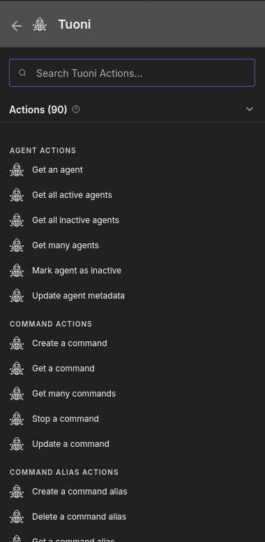
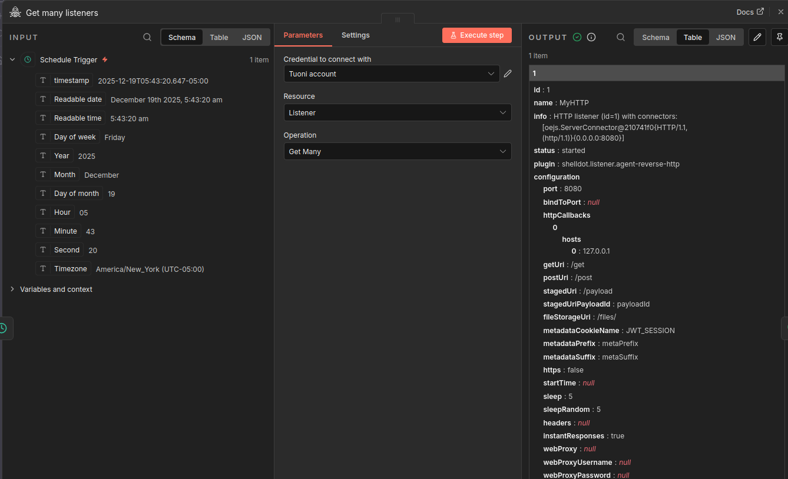
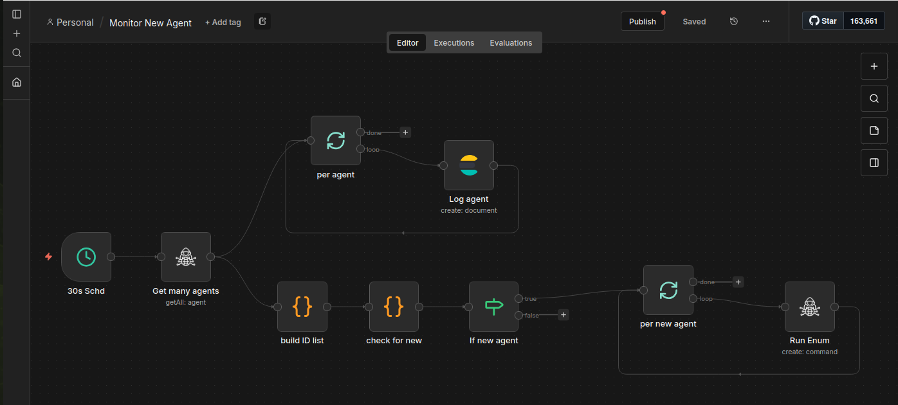

<div align="center">

&nbsp;&nbsp;&nbsp;&nbsp;&nbsp;&nbsp;&nbsp;&nbsp;&nbsp;&nbsp;&nbsp;&nbsp;&nbsp;&nbsp;&nbsp;&nbsp;

</div>
<br>

# Tuoni Community Node for n8n

> **⚠️ BETA SOFTWARE**: This package is currently in beta. While functional, you may encounter issues or missing features. Please [open an issue](https://github.com/numbfrank/n8n-nodes-tuoni/issues) if you find any bugs or have feature requests. Contributions are welcome!

This n8n community node integrates with [Tuoni](https://github.com/shell-dot/tuoni), a penetration testing command and control framework. Automate common C2 operations in your n8n workflows: manage agents, run commands, control listeners/payloads, handle files, react to events, and administer users/settings.

[n8n](https://n8n.io/) is a [fair-code licensed](https://docs.n8n.io/sustainable-use-license/) workflow automation platform.

- [Installation](#installation)
- [Credentials](#credentials)
- [Operations](#operations)
- [Usage](#usage)
- [Compatibility](#compatibility)
- [Contributing](#contributing)
- [License](#license)
- [Resources](#resources)

## Installation

> **Note:** This package is currently in beta and not yet published to npm. You'll need to install it locally.

### Local Installation

1. **Clone the repository:**
   ```bash
   git clone https://github.com/numbfrank/n8n-nodes-tuoni.git
   cd n8n-nodes-tuoni
   ```

2. **Install dependencies and build:**
   ```bash
   npm install
   npm run build
   ```

3. **Link the package to your n8n installation:**
   ```bash
   # Create a symbolic link
   npm link
   
   # In your n8n installation directory (or global n8n)
   cd ~/.n8n/nodes  # or your custom n8n nodes directory
   npm link n8n-nodes-tuoni
   ```

4. **Restart n8n** to load the new node.

5. Once installed, search for the node named "Tuoni" in the n8n editor.

For more details, see the [official community nodes guide](https://docs.n8n.io/integrations/community-nodes/installation/).

## Credentials

Create a new credential of type “Tuoni API” in n8n:

- **Server URL**: Base URL to your Tuoni instance (e.g., `https://localhost:8443` or `https://tuoni.example.com:8443`)
- **Username**: Your Tuoni username
- **Password**: Your Tuoni password
- **Ignore SSL Issues**: Enable this for self-signed certificates (common in local/test environments)
- **Authentication Method**: Choose between:
  - **Basic (Username/Password)** - Recommended, works for all basic operations
  - **JWT** - Obtains and caches a JWT token for subsequent requests

The credential includes a built-in test that validates connectivity to your Tuoni server. In Basic mode, it tests against `/api/v1/agents`. In JWT mode, it performs a login to verify credentials and obtain a token.

## Operations

This node exposes multiple resource categories. Each category includes common CRUD and control actions aligned with Tuoni’s REST API.

- Agents: list/get, active/inactive filters, mark inactive, update metadata.
- Commands: list/get, create for an agent, stop, update.
- Command Templates & Aliases: list/get, create/update/delete, fetch agent templates.
- Discovery (Credentials, Hosts, Services): list/get, create/update, events, bulk archive/restore.
- Events: get event summaries and full details.
- Files (Storage): list/get, by path, download/upload, update, delete.
- Jobs: list/all vs. active, get by id, pause/resume/restart.
- Listeners: create/update/delete, start/stop.
- Payloads & Payload Templates: list/get, create/update/delete, download.
- Plugins: list/get per type (command/listener/payload), enable/disable command plugins.
- Scripts: list/get info/content, fetch raw logs or log lines (with query params).
- Settings: list/get, update one or many settings.
- Users: list/get/me, create/update, change password (self or admin).
- IPs: list known IPs.

<div align="center">



</div>

## Usage

1. Add the “Tuoni” node to a workflow and select your “Tuoni API” credential.
2. Choose a **Resource** (e.g., Agent, Command, Listener), then an **Operation** (e.g., Get All, Create, Update).
3. Fill in required parameters based on the operation.
4. Execute the workflow to interact with the Tuoni server.

<div align="center">



</div>

### Example Workflows

**Automated Command Execution:**

- Use **Agent → Get All** to list active agents
- For each agent, use **Command → Create** to execute commands
- Use **Command → Get** to check command status and retrieve results

**Listener & Payload Management:**

- **Listener → Create** to start a new listener
- **Payload Template → Create** to define a payload configuration
- **Payload → Create** to generate the payload binary
- **Payload → Download** to retrieve the generated artifact

**Discovery & Threat Hunting:**

- **Discovered Host → Get All** to enumerate discovered hosts
- **Discovered Service → Get All** to list services per host
- **Discovered Credential → Get All** to review harvested credentials
- **Event → Get All** to track discovery events and timeline

**Administration:**

- **User → Create** and **User → Update** for user management
- **Setting → Update Multiple** for bulk configuration changes
- **Script → Get Logs** to monitor script execution and debugging

<div align="center">



</div>

## Compatibility

Tested with n8n 1.60.0 and later. Community nodes generally follow n8n’s minor version compatibility, but please pin versions as needed in your environment.

**Requirements:**

- n8n >= 1.60.0
- Tuoni with REST API enabled (typically running on port 8443)
- Network access from your n8n instance to the Tuoni server

## Contributing

Contributions are welcome! This is a community-maintained project.

- **Bug Reports**: [Open an issue](https://github.com/numbfrank/n8n-nodes-tuoni/issues) with details about the problem
- **Feature Requests**: Submit an issue describing your use case and proposed enhancement
- **Pull Requests**: Fork the repository, create a feature branch, and submit a PR

Before submitting code:

```bash
npm run lint        # Check for linting errors
npm run build       # Ensure the package builds successfully
```

## License

MIT License - see [LICENSE](LICENSE) file for details.

## Resources

- [n8n Community Nodes Documentation](https://docs.n8n.io/integrations/community-nodes/)
- [Tuoni](https://github.com/shell-dot/tuoni)
- [Tuoni Documentation](https://docs.shelldot.com/)
- [Tuoni API Documentation](https://docs.shelldot.com/REST/API/api.html)
- [Report Issues](https://github.com/numbfrank/n8n-nodes-tuoni/issues)
